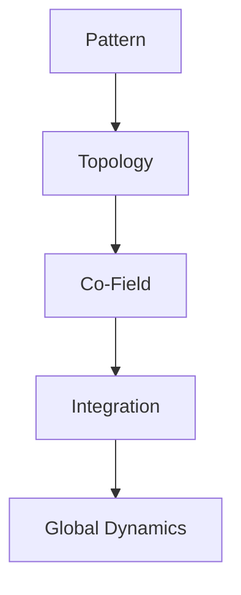

# Meta-System Master Map

This page provides a simplified, GitHub-safe master map of the entire system.  
All Mermaid diagrams are intentionally minimal to avoid parsing conflicts.

---

# 1. Core Structural Stack


```
flowchart TD
    E[Global Dynamics] --> F[Self-Evaluation]
    F --> G[Validation Plan]
    E --> H[Tasks]
    H --> I[Workflows]

