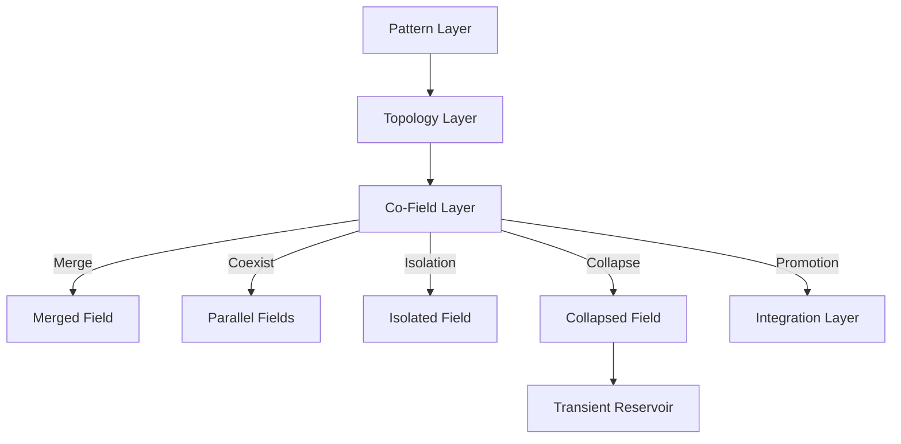

# **Co-Field Layer — README**

*Directory: `meta/meta-process/co-field/`*

The Co-Field layer defines how multiple structural fields interact during the meta-process.
It coordinates parallel structures, resolves conflicts, manages reinforcement, and ensures that only coherent forms progress toward integration.

This directory provides the conceptual, structural, and semantic definition of the Co-Field, including specifications, rules, stability maps, examples, and machine-readable schema.

---

## **1. Purpose**

The Co-Field governs the interactions between:

* pattern fields
* topological fields
* integration candidates
* transient cognitive structures

Its role is to maintain coherence when several structural forms appear simultaneously.
It ensures that the global meta-architecture remains stable while insight develops.

---

## **2. Core Functions**

The Co-Field performs four primary operations:

* **Synchronization:** Aligns fields evolving at different speeds.
* **Conflict Resolution:** Determines outcomes when fields compete.
* **Reinforcement:** Merges or co-stabilizes fields that strengthen each other.
* **Isolation:** Prevents interfering fields from destabilizing the system.

Only fields that reach sufficient stability and weight are promoted to the Integration Layer.

---

## **3. Structure of This Directory**

### **3.1 `index.md`**

Overview of the Co-Field concept, purpose, operations, and backlog.

### **3.2 `index.jsonld`**

Machine-readable metadata defining:

* Co-Field
* Field Weight
* Stability Threshold
* Interaction Surface
* Collapse Trigger

Used by the repo’s semantic layer.

### **3.3 `co-field-spec.md`**

Formal description of the Co-Field including:

* variables (C, W, T, I)
* operational rules
* output states

### **3.4 `interaction-rules.md`**

Details allowed/disallowed interactions, priority rules, and triggers.

### **3.5 `stability-map.md`**

Defines stability zones and transition logic:

* stable
* semi-stable
* unstable
* critical

### **3.6 `examples.md`**

Concrete minimal cases showing:

* merge
* collapse
* promotion
* coexistence

---

## **4. Position in the Meta-Architecture**

The Co-Field sits between:

```
Pattern Layer → Topology Layer → Co-Field → Integration Layer
```

It transforms multiple structural candidates into coherent outputs.
It does not generate content; it manages structural dynamics.

---

## **5. Outputs**

The Co-Field produces five possible outcomes:

* **merged field**
* **parallel fields**
* **isolated field**
* **collapsed field**
* **promoted field** → sent to Integration Layer

Unstable or collapsed fields return to the transient reservoir.

---

## **6. Semantic Role**

The Co-Field contributes to the repository’s global semantic graph by:

* defining interaction-level vocabulary
* linking field dynamics to higher-order integration
* supporting automatic extraction tools

It acts as the “coordination layer” in the meta-process ontology.

---

## **7. Mermaid Overview**



---

## **8. Backlog**

The Co-Field backlog includes:

* expanding semantic vocabulary
* refining thresholds and weights
* adding multi-field interaction maps
* defining cross-layer consistency rules

See `index.md` for the full backlog.

---

## **9. Status**

This directory is part of the high-order meta-process and actively evolves as the overall architecture stabilizes.
It should remain minimal, precise, and strictly structural.
