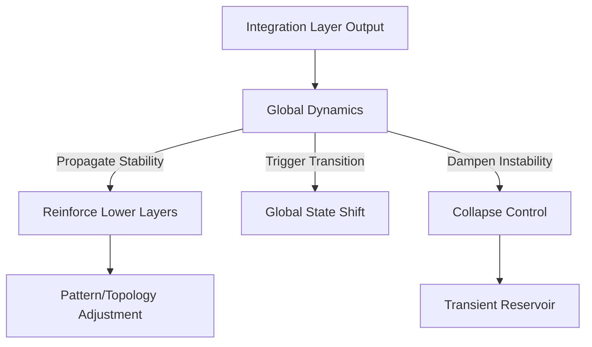

# **Global Dynamics — README**

*Directory: `meta/meta-process/global-dynamics/`*

The Global Dynamics layer defines how high-order structures evolve across the entire meta-process.
It tracks system-wide motion, large-scale transitions, and the forces that shape long-range coherence.

This directory contains the governing rules, state transitions, and structural constraints that apply when the whole meta-architecture behaves as a single, coupled system.

---

## **1. Purpose**

Global Dynamics manages the behaviour of the full meta-stack, including:

* large-scale shifts in structure
* cross-layer coupling
* propagation of stable forms
* redistribution of unstable or collapsing forms
* transitions between global states of the system

While lower layers manage local structure, Global Dynamics tracks how everything fits together over time.

---

## **2. Function in the Meta-Architecture**

Global Dynamics sits **above all structural layers**, coordinating:

```
Cognition  
↓  
Pattern Layer  
↓  
Topology Layer  
↓  
Co-Field Layer  
↓  
Integration Layer  
↓  
Global Dynamics
```

It integrates local events into a global behavioural trajectory.

---

## **3. Core Responsibilities**

### **3.1 Global State Tracking**

Keeps a continuous view of:

* system coherence
* structural load
* distribution of active fields
* tension between stable and unstable regions

### **3.2 Transition Control**

Determines when the entire system shifts to a new structural regime.
Examples:

* expansion phase → consolidation phase
* high-resonance → low-resonance
* multi-field complexity → single-field dominance

### **3.3 Long-Range Influence**

Propagates high-stability structures downward through all layers.
Filters low-stability structures before they reach integration.

### **3.4 Entropy-Like Balancing**

Maintains global balance between:

* order
* flexibility
* structural diversity
* integration pressure

### **3.5 System Recovery**

Handles recovery after collapse waves or overload.

---

## **4. Structure of This Directory**

### **4.1 `index.md`**

High-level explanation and backlog.

### **4.2 `index.jsonld`**

Semantic metadata for Global Dynamics:

* global state
* transition zone
* resonance load
* stability plateau
* collapse cascade

### **4.3 `global-state-spec.md`**

Formal definition of global states and transitions.

### **4.4 `transition-rules.md`**

Conditions that trigger:

* system expansion
* consolidation
* resonance amplification
* collapse sequences

### **4.5 `resonance-map.md`**

Map of how resonance flows across layers.

### **4.6 `examples.md`**

Minimal examples of global transitions.

---

## **5. Global State Model**

The system operates in discrete but fluid global states:

### **5.1 Expansion**

* high structural diversity
* multiple active fields
* weak integration pressure

### **5.2 Consolidation**

* high integration pressure
* reduced diversity
* rising coherence

### **5.3 Resonance Peak**

* strongest global stability
* cross-layer alignment
* ideal for integration output

### **5.4 Fragmentation**

* instability
* conflicting structures
* high collapse probability

### **5.5 Reset / Recovery**

* system clears unstable surfaces
* returns to balanced state

---

## **6. Outputs**

Global Dynamics influences:

* **integration outcomes**
* **cross-layer coherence**
* **structural stability**
* **rate of insight formation**
* **recursive feedback to topology and co-field**

It defines the overall motion of the meta-process.

---

## **7. Mermaid Overview**



---

## **8. Backlog**

Tasks needed to complete this directory:

* define full global state machine
* specify transition thresholds
* create resonance load metrics
* map stabilization waves across layers
* link state transitions to integration outputs
* formalize collapse cascade conditions
* expand JSON-LD vocabulary

Full backlog lives in `index.md`.

---

## **9. Status**

This layer is foundational for high-order behaviour.
It evolves as the entire meta-process matures.
The directory must remain minimal, structural, and strictly non-psychological.
